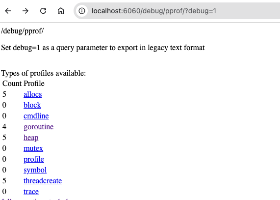
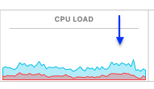
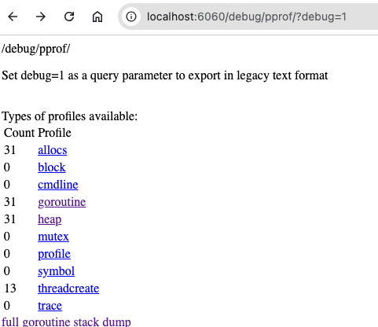
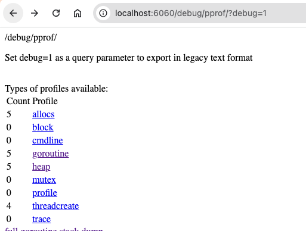
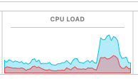
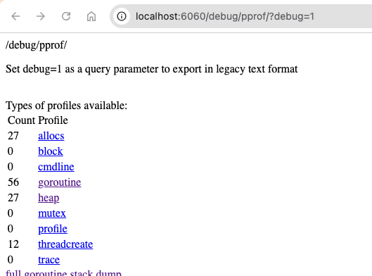

# api-stress-kit 🚀

A minimal, production-ready starter to **build**, **benchmark**, and **stress‑test** REST APIs using **Go**, **Gin**, and popular load tools (**Vegeta** / **k6**).

## Features
- ⚡ Fast HTTP API with Gin (`/ping`, `/health`, `/users`)
- 🧪 Stress testing via **Vegeta** and **k6**
- 🐳 Dockerfile + docker-compose for reproducible runs
- ✅ Basic unit test for `/ping`

## Quick Start
```bash
# Run locally
go mod tidy
go run main.go
```

## Install Load Testing Tools
```bash
# Vegeta
go install github.com/tsenart/vegeta/v12@latest
# or using Homebrew
brew install vegeta

# k6
brew install k6
```

### Vegeta (CLI)
```bash
echo "GET http://localhost:8080/ping" | vegeta attack -duration=15s -rate=200 | vegeta report
```

### k6 (CLI)
```bash
k6 run tests/stress/k6_test.js
```

## Docker
```bash
docker-compose up --build
# Server on http://localhost:8080
```


## Endpoints
- `GET /ping` → `{ message: "pong", latency_ms: <int> }`
- `GET /health` → `{ status: "ok" }`
- `GET /users` → JSON list of demo users

## Output
```
% k6 run tests/stress/k6_test.js

         /\      Grafana   /‾‾/  
    /\  /  \     |\  __   /  /   
   /  \/    \    | |/ /  /   ‾‾\ 
  /          \   |   (  |  (‾)  |
 / __________ \  |_|\_\  \_____/ 

     execution: local
        script: tests/stress/k6_test.js
        output: -

     scenarios: (100.00%) 1 scenario, 20 max VUs, 50s max duration (incl. graceful stop):
              * default: 20 looping VUs for 20s (gracefulStop: 30s)


  █ TOTAL RESULTS 

    checks_total.......: 800     39.425515/s
    checks_succeeded...: 100.00% 800 out of 800
    checks_failed......: 0.00%   0 out of 800

    ✓ status was 200

    HTTP
    http_req_duration..............: avg=5.71ms   min=710µs    med=5.67ms   max=15.08ms  p(90)=9.34ms   p(95)=12.44ms 
      { expected_response:true }...: avg=5.71ms   min=710µs    med=5.67ms   max=15.08ms  p(90)=9.34ms   p(95)=12.44ms 
    http_req_failed................: 0.00%  0 out of 800
    http_reqs......................: 800    39.425515/s

    EXECUTION
    iteration_duration.............: avg=507.21ms min=500.91ms med=507.06ms max=519.43ms p(90)=512.86ms p(95)=515.16ms
    iterations.....................: 800    39.425515/s
    vus............................: 20     min=20       max=20
    vus_max........................: 20     min=20       max=20

    NETWORK
    data_received..................: 125 kB 6.2 kB/s
    data_sent......................: 59 kB  2.9 kB/s


running (20.3s), 00/20 VUs, 800 complete and 0 interrupted iterations
default ✓ [======================================] 20 VUs  20s
```

```
% echo "GET http://localhost:8080/users" | vegeta attack -duration=15s -rate=200 | vegeta report
Requests      [total, rate, throughput]         3000, 200.07, 200.05
Duration      [total, attack, wait]             14.996s, 14.995s, 1.339ms
Latencies     [min, mean, 50, 90, 95, 99, max]  428.25µs, 1.749ms, 1.252ms, 3.208ms, 4.227ms, 8.217ms, 33.845ms
Bytes In      [total, mean]                     141000, 47.00
Bytes Out     [total, mean]                     0, 0.00
Success       [ratio]                           100.00%
Status Codes  [code:count]                      200:3000  
Error Set:
```

## Performance Comparison

```bash
echo "GET http://localhost:8080/users" | vegeta attack -duration=10s -rate=2000 | vegeta report
```

### => Native Execution
```bash
go run main.go
```
- 0 Rquests:<br />
  
- 10s @ 2000 RPS:<br />
<br/>



### => Inside Docker:
```bash
docker-compose up --build
```
- 0 Requests:<br />

  
- 10s @ 2000 RPS:<br />
<br/>



## License
MIT


## Maintainer

**Khaled Alam**  
Full-Stack Software Engineer<br />
[Portfolio](https://khaledalam.net)  
[khaledalam.net@gmail.com](mailto:khaledalam.net@gmail.com)  
LinkedIn: [linkedin.com/in/khaledalam](https://linkedin.com/in/khaledalam)
